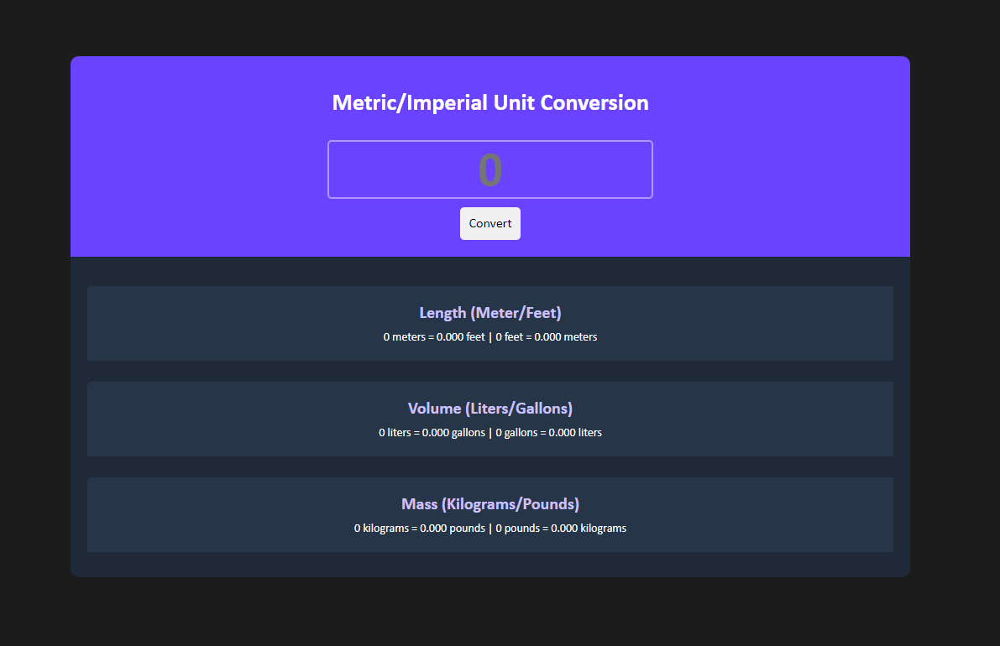

# Unit Converter - Scrimba Project
This is a solution to the [Unit Converter Solo Project on Scrimba](https://scrimba.com/learn/learnjavascript/solo-project-unit-converter-cz9aPNSr). 

### Screenshot

### The challenge

- Build the app from scratch following the provided design on [Figma](https://www.figma.com/file/cqtGul0V8RFXY4vTcIv1Kc/Unit-Conversion?node-id=0%3A1&t=Nwv5BFjVGby0DIly-0)
- Generate all conversions when the user clicks on "Convert"
- Round the numbers down to three decimal places

### Links

- Solution URL: https://clementbartholome.github.io/Unit-Converter-Scrimba-Project/
- Scrimba "Learn JavaScript for free" course: https://scrimba.com/learn/learnjavascript

### Built with

- HTML
- CSS
- JavaScript

### What I learned

This project helped me improve my JavaScript skills. It made me practice template literals and DOM manipulation. I also learned how to round number according to chosen number of decimals using the tofixed() method. 

### Useful resources

- [Scrimba](https://scrimba.com/dashboard#overview) - The source of this project.
- [freeCodeCamp](https://www.freecodecamp.org/learn/) - Another ressource I used to learn HTML, CSS, JS and more for free. 
- [W3Schools](https://www.w3schools.com/howto/howto_css_animate_buttons.asp) - The source of the  onclick "ripple" effect I added on this project.

## Author

- LinkedIn - [Clément Bartholomé](https://www.linkedin.com/in/clementbartholome/)
- Frontend Mentor - [@ClementBartholome](https://www.frontendmentor.io/profile/ClementBartholome)
